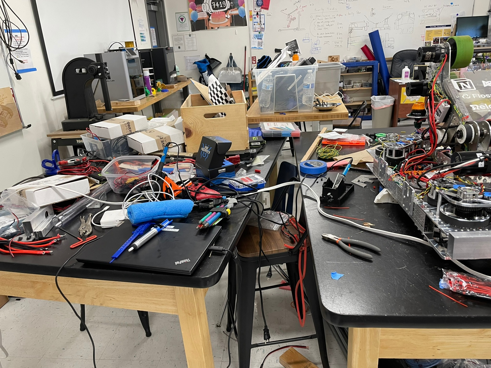

# T.E.C.H Support

This year I joined my school's FIRST Robotics team (FRC), 7419 T.E.C.H Support as a part of the mechanical team. It was a pretty amazing year learning so much and getting to know many great people.

## Shop

Shop hours were the highlight of this year, the excitement of getting to work on the robot after hours of sitting at a chair. Learned a lot of new things intertwined with funny moments with friends. Blowing sawdust off the CNC is very satisfying.

The usual work setup after shop hours.

## Competition

This year we competed at Silicon Valley, Arizona Valley, East Bay Regional – and the World Championships in Houston.

Can't wait for another year.

> Working hard or hardly working?
