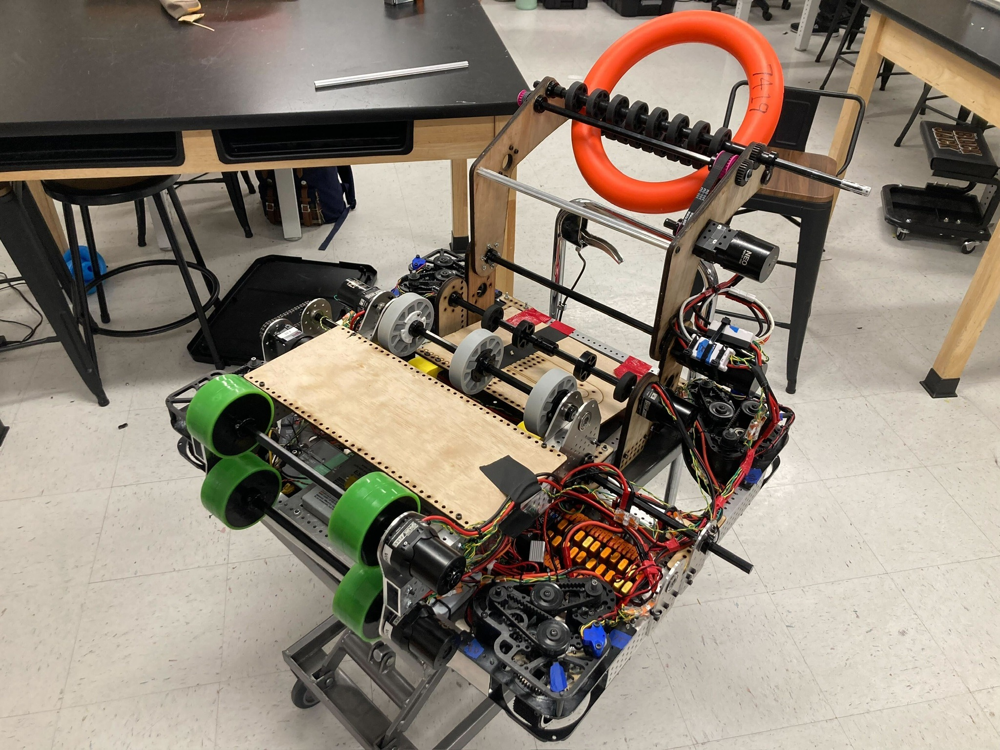
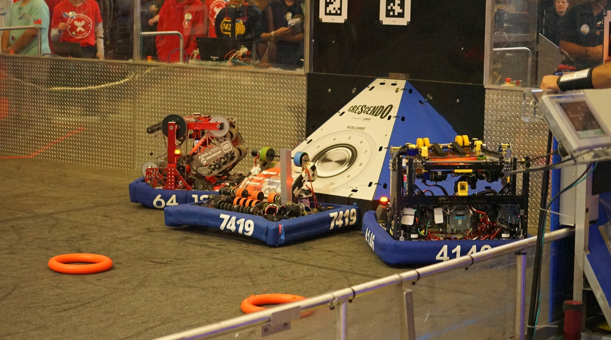
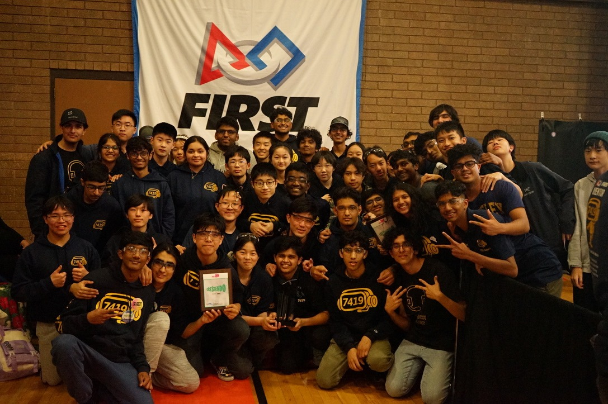

# 7419 T.E.C.H Support

This year I joined my school's FIRST Robotics team (FRC), 7419 T.E.C.H Support as a part of the mechanical subteam. Through this, I think I've learned a lot about engineering and myself more than I ever have. But first, some of my favorite pictures from the season.

## Shop

Our alpha bot.

The usual work setup after shop hours.

## Competition

This year we competed at Silicon Valley, Arizona Valley, East Bay Regional – and the World Championships in Houston.

Pushing out the robot cart into a stadium full of teams from across the country is an indelible memory.

Now back to the talking, joining the team has been one of the most incredible experiences, not just because of the amazing things I've learned in engineering but also the people.

I remember falling down the rabbit hole of [Chief Delphi](https://www.chiefdelphi.com/) after the first few months of joining, watching every FRC Robot Reveal video, reading open alliance blogs, and eventually addicted to FRC ever since. Nothing can replace the feeling of late nights assembling mechanisms or tediously watching every pass on the CNC.

For me, the greatest part of FRC has been the people I've met, the shared experiences of working together but the friends I've made who have become my own mentors. Im truly grateful for the advice they've given whether it be random philosophical questions or getting through high school.

Can't wait for another year, but now as a leader too.
